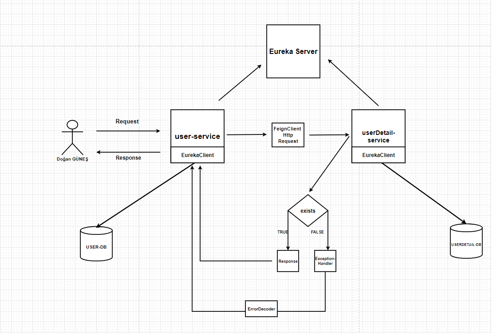

# How To Use OpenFeign and ErrorDecoder

## Topology


---

## ErrorDecoder implements
### Attention ! (use customize according to your needs)
```
public class RetreiveMessageErrorDecoder implements ErrorDecoder {
    private ErrorDecoder errorDecoder = new Default();

    @Override
    public Exception decode(String methodKey, Response response) {
        ExceptionMessage message = null;
        try (InputStream bodyIs = response.body()
            .asInputStream()) {
            ObjectMapper mapper = new ObjectMapper();
            message = mapper.readValue(bodyIs, ExceptionMessage.class);
        } catch (IOException e) {
            return new Exception(e.getMessage());
        }
        switch (response.status()) {
        case 400:
            return new BadRequestException(message.getMessage() != null ? message.getMessage() : "Bad Request");
        case 404:
            return new NotFoundException(message.getMessage() != null ? message.getMessage() : "Not found");
        default:
            return errorDecoder.decode(methodKey, response);
        }
    }
}
```
---
### Customize Message Class
Message Contents
* status
* error
* message
* bla bla bla (your needs)
```
public class ExceptionMessage {
    private String timestamp;
    private int status;
    private String error;
    private String message;
    private String path;
    // standard getters and setters
}

```
---

### Test Application
```
Rest Client Url

- localhost:8082/v1/api/getUserDetailByUserId/1
- localhost:8081/v1/api/getUserDetailDtoById/1
- localhost:8082/v1/api/getAllUserDetail

```
